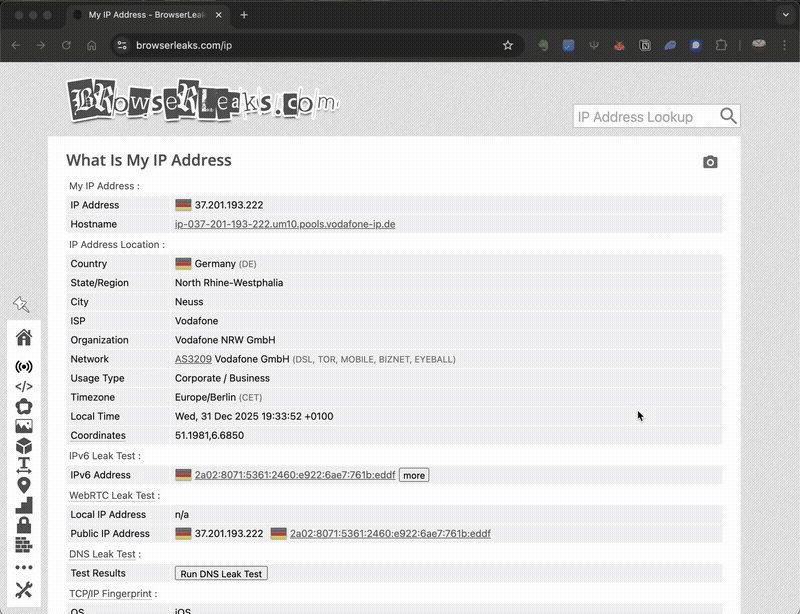

# region-proxy

[](https://github.com/M-Igashi/region-proxy/actions/workflows/ci.yml)
[](https://github.com/M-Igashi/region-proxy/releases)
[](https://github.com/M-Igashi/region-proxy/releases/latest)
[](https://opensource.org/licenses/MIT)

A CLI tool to create a SOCKS proxy through AWS EC2 in any region.



## Features

- **Multi-region support** – Launch a proxy in any of 17 AWS regions
- **One command setup** – Automatically handles EC2 instance, security groups, and SSH keys
- **Configurable defaults** – Set default region, port, and other preferences
- **Secure** – Uses SSH dynamic port forwarding (SOCKS5 proxy)
- **macOS integration** – Automatically configures system-wide SOCKS proxy
- **Clean shutdown** – Automatically terminates EC2 instance and cleans up all AWS resources
- **Cost-effective** – Uses the smallest instance types (t4g.nano/t3.nano, ~$0.004/hour)

## Quick Start

```bash
# Install
brew tap M-Igashi/tap
brew install region-proxy

# Start proxy in Tokyo
region-proxy start --region ap-northeast-1

# Verify your IP
curl ipinfo.io

# Stop and cleanup
region-proxy stop
```

## Prerequisites

- macOS
- AWS account with EC2 permissions
- AWS CLI configured (`aws configure`)

## Installation

### Homebrew (Recommended)

```bash
brew tap M-Igashi/tap
brew install region-proxy
```

### From Source

```bash
git clone https://github.com/M-Igashi/region-proxy.git
cd region-proxy
cargo install --path .
```

## Usage

### Start a proxy

```bash
region-proxy start --region ap-northeast-1
region-proxy start --region us-west-2 --port 8080
region-proxy start --no-system-proxy  # Don't configure system proxy
```

### Check status

```bash
region-proxy status
```

### Stop the proxy

```bash
region-proxy stop
region-proxy stop --force  # Continue even if some cleanup fails
```

### List available regions

```bash
region-proxy list-regions
region-proxy list-regions --detailed
```

### Configuration

```bash
region-proxy config show
region-proxy config set-region ap-northeast-1
region-proxy config set-port 8080
region-proxy config reset
```

### Cleanup orphaned resources

```bash
region-proxy cleanup
region-proxy cleanup --region ap-northeast-1
```

## AWS Setup

Create an IAM policy with the following permissions:

```json
{
    "Version": "2012-10-17",
    "Statement": [
        {
            "Effect": "Allow",
            "Action": [
                "ec2:DescribeImages",
                "ec2:DescribeInstances",
                "ec2:DescribeSecurityGroups",
                "ec2:DescribeKeyPairs",
                "ec2:RunInstances",
                "ec2:TerminateInstances",
                "ec2:CreateSecurityGroup",
                "ec2:DeleteSecurityGroup",
                "ec2:AuthorizeSecurityGroupIngress",
                "ec2:CreateKeyPair",
                "ec2:DeleteKeyPair",
                "ec2:CreateTags"
            ],
            "Resource": "*"
        }
    ]
}
```

Then configure AWS CLI:

```bash
aws configure
```

## How it works

1. Creates a minimal EC2 instance (t4g.nano) with Amazon Linux 2023
2. Creates a temporary security group allowing SSH access
3. Generates a temporary SSH key pair
4. Establishes an SSH tunnel with dynamic port forwarding
5. Optionally configures macOS system proxy

When you stop the proxy, all resources are automatically cleaned up.

## Troubleshooting

**AuthFailure or credential errors**

```bash
aws sts get-caller-identity
```

**No region specified**

```bash
region-proxy config set-region ap-northeast-1
```

**Orphaned resources**

```bash
region-proxy cleanup
```

## License

MIT License - see [LICENSE](LICENSE) for details.
